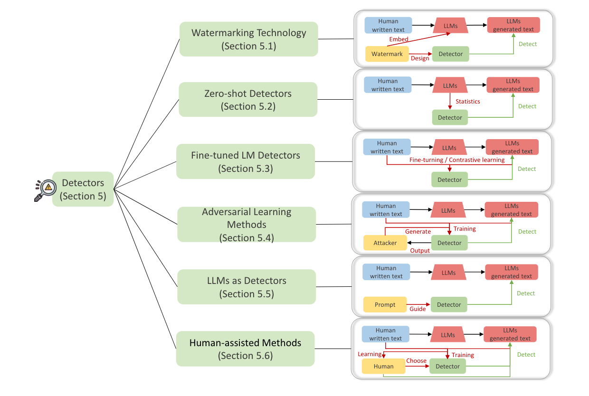

# Awesome LLM-generated Text Detection

[](https://awesome.re)
[](./LICENSE)


The powerful ability of large language models (LLMs) to understand, follow, and generate complex languages has enabled LLM-generated texts to flood many areas of our daily lives at an incredible rate, with potentially negative impacts and risks on society and academia. As LLMs continue to expand, how can we detect LLM-generated texts to help minimize the threat posed by the misuse of LLMs?

<div align="center">
  
</div>
<br>
<!-- **Authors:** -->

**_¹ [Junchao Wu](https://github.com/junchaoIU), ¹ [Shu Yang](https://twitter.com/shuyhere), ¹ [Runzhe Zhan](https://runzhe.me/), ¹ ² [Yulin Yuan](https://fah.um.edu.mo/yulin-yuan/), ¹ [Derek Fai Wong](https://www.fst.um.edu.mo/personal/derek-wong/), ¹ [Lidia Sam Chao]()_**


<!-- **Affiliations:** -->

¹ University of Macau, ² Peking University

## 📢 News
* [2023.10.24] Our survey paper is now available on Arxiv:
* [2023.10.07] : We start **Chinese LLM-generated Essay Detection** Project.
* [2023.05.01] : We began to explore the topic of LLM-generated Text Detection.

## 📃 Papers
### Overview

We mainly analyzed the work related to LLM-generated Text Detection from the following points, and refer to our paper for more details.

### Datasets
#### Benchmarks

|                                                               | Use              | Human            | LLMs         |
|------------------------------------------------------------------------|------------------|------------------|--------------|
| [HC3](https://arxiv.org/abs/2301.07597)                                | train            | 58k              | 26k          |
| [HC3-Chinese](https://arxiv.org/abs/2301.07597)                        | train            | 22k              | 17k          |
| [CHEAT](https://arxiv.org/abs/2304.12008)                              | train            | 15k              | 35k          |
| [GROVER Dataset](https://arxiv.org/abs/1905.12616)                     | train valid test | 5k 2k 8k         | 5k 1k 4k     |
| [TweepFake](https://arxiv.org/abs/2008.00036)                          | train            | 12k              | 12k          |
| [GPT-2 Output Dataset](https://github.com/openai/gpt-2-output-dataset) | train            | 250k             | 250k         |
| [TuringBench](https://aclanthology.org/2021.findings-emnlp.172/)       | train            | 10k              | 190k         |
| [MGTBench](https://arxiv.org/abs/2303.14822)                           | train test       | 2k 563           | 13k 3k       |
| [ArguGPT](https://arxiv.org/pdf/2304.07666.pdf)                                                                | train valid test | 3k 350 350       | 3k 350 350   |
| [DeepfakeText-Detect-Dataset](https://arxiv.org/abs/2210.09421)                                           | train valid test | 319k 56.8k 56.8k | -            |
| [M4](https://arxiv.org/abs/2305.14902)                                                                     | train valid test | 122k 500 500     | 122k 500 500 |
| [GPABenchmark](https://arxiv.org/abs/2306.05524)                                                           | train            | 600k             | 600k         |
| [Scientific-articles Benchmark](https://aclanthology.org/2023.trustnlp-1.17/)                                          | train test       | 8k 4k            | 8k 4k        |

#### Corpus

### Detector


#### Watermark Technology

| Paper                                                                                                         | Link                                                                                                                                                                                                                                                        |
|---------------------------------------------------------------------------------------------------------------|-------------------------------------------------------------------------------------------------------------------------------------------------------------------------------------------------------------------------------------------------------------|
|  A watermark for large language models.                                               | [](https://arxiv.org/abs/2301.10226)      [](https://github.com/jwkirchenbauer/lm-watermarking)                                                                                                          |
| On the Reliability of Watermarks for Large Language Models                                               | [](https://arxiv.org/abs/2306.04634) [](https://github.com/jwkirchenbauer/lm-watermarking)                                                                                                                               |
| Distillation-Resistant Watermarking for Model Protection in NLP                          | [](https://arxiv.org/abs/2210.03312) [](https://github.com/xuandongzhao/drw)                |
| Watermarking Pre-trained Language Models with Backdooring                    | [](https://arxiv.org/abs/2210.07543)                                                                                                               |
#### Zero-shot Methods


## 🚩 Citation

If our research helps you, please kindly cite our paper.

```bibtex

```


## Contributing
Contributions are welcome! If you have any ideas, suggestions, or bug reports, please open an issue or submit a pull request. We appreciate your contributions to making LLM-generated Text Detection work even better.


